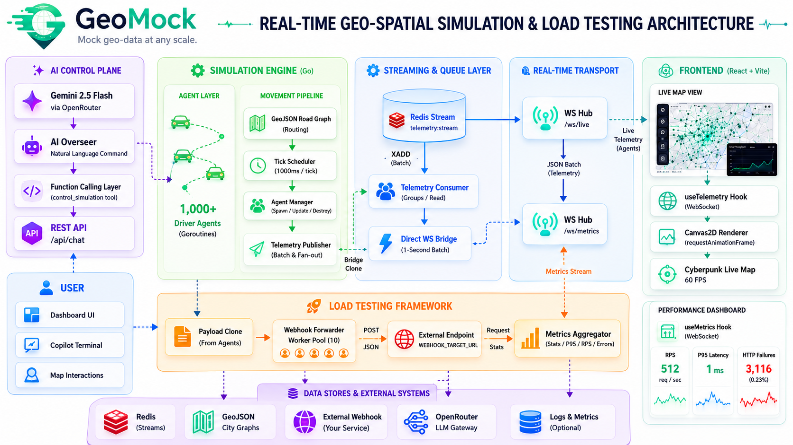

# GeoMock

GeoMock is a high-performance, real-time spatial simulation engine and load-testing framework. It is designed to simulate thousands of concurrent driver agents moving across real-world road networks (using GeoJSON graphs) while streaming high-throughput telemetry data. 

## What it Solves
GeoMock is built to solve the complex challenge of testing and visualizing high-volume, real-time geospatial data pipelines. Whether you are building a ride-hailing app, a logistics tracking system, or a smart city dashboard, GeoMock provides the realistic, high-throughput mock data needed to stress-test your architecture. It allows developers to:
- Generate thousands of concurrent location updates effortlessly.
- Verify system performance under heavy load using built-in load testing and metrics.
- Visualize massive amounts of moving agents on a map in real-time without browser performance degradation.
- Control simulations using Natural Language powered by an AI Overseer.

## Necessary Features
- **High-Concurrency Engine:** Simulates 1,000+ driver agents concurrently in Go, utilizing a highly optimized, tick-driven movement model.
- **GeoJSON Graph Routing:** Upload a city's road network, and agents will intelligently navigate real road nodes instead of random wandering.
- **Real-Time Data Streaming:** Uses Redis Streams to batch and broadcast high-throughput telemetry via WebSockets to the frontend.
- **AI Overseer Copilot:** Control the simulation naturally. Ask the AI to "spawn 500 riders in Tokyo," and it will automatically adjust the engine and teleport the map.
- **Load-Test Framework:** Includes a worker pool that blasts mock telemetry payloads to a specified webhook, aggregating P95 latency and RPS metrics in real-time.
- **60-FPS Cyberpunk Canvas Map:** The frontend uses an innovative `CanvasOverlay` atop Leaflet maps, ensuring buttery-smooth 60 FPS rendering of thousands of glowing agent trails with zero React re-renders.
- **Performance Diagnostics Dashboard:** Real-time visual tracking of HTTP request rates, failures, and system latency.

## User Flow


## System Architecture



The architecture of GeoMock is split into a robust backend and a highly optimized frontend.

**Backend (Go + Redis):**
- **Simulation Engine:** Spawns thousands of goroutines (one per agent). Each agent calculates waypoints and movement based on a GeoJSON road graph.
- **Queue Pipeline:** Batches telemetry data and flushes it into a Redis Stream. A secondary direct WebSocket bridge ensures real-time streaming even without Redis.
- **Load-Test Worker Pool:** Concurrently pushes data to external webhooks and funnels response metrics into an aggregator.
- **AI Integrator:** Uses OpenRouter (Gemini) to parse natural language into simulation controls via function calling.

**Frontend (React + Vite + TypeScript):**
- **Live WebSocket Hub:** Receives telemetry and metrics at 1Hz without causing expensive React state updates.
- **Canvas2D Render Loop:** Bypasses DOM manipulation by drawing directly onto a `<canvas>` element using a `requestAnimationFrame` loop, enabling high-performance visual trails.


## Folder Structure

```text
geomock/
├── .env                    # Environment variables (API Keys, URLs)
├── DESIGN.md               # Detailed technical design document
├── geomock_progress_report.md # Project status and deep-dive documentation
├── main.go                 # Backend entry point, WebSocket handlers, HTTP routes
├── go.mod / go.sum         # Go dependencies
├── start.ps1               # Helper script to launch both backend and frontend
│
├── internal/               # Go backend services
│   ├── ai/                 # Gemini API integration & function calling
│   ├── engine/             # Agent simulation logic & manager
│   ├── graph/              # GeoJSON parsing and road network routing
│   ├── loadtest/           # Webhook forwarding and metrics aggregation
│   └── queue/              # Redis pub/sub and batching logic
│
└── frontend/               # React + TypeScript Web Application
    ├── package.json        # Frontend dependencies
    ├── vite.config.ts      # Vite bundler configuration
    ├── index.html          # HTML entry point
    │
    ├── public/             # Static assets
    │
    └── src/
        ├── App.tsx         # Main layout and view routing
        ├── index.css       # Design System (Cyberpunk Theme)
        ├── components/     # React UI Components (Sidebar, Map, Terminal, Dashboards)
        └── hooks/          # Custom hooks (WebSocket connection handling)
```

## Dependencies & Installation

### Prerequisites
Before you start, ensure you have the following installed on your system:
- **Go** (1.22 or newer)
- **Node.js** (v18+ recommended)
- **Redis** (running locally on default port 6379, optional but recommended for full pipeline)

### Installation Steps

1. **Clone the repository:**
   ```bash
   git clone https://github.com/kaisen354/Geomock.git
   cd Geomock
   ```

2. **Environment Configuration:**
   Create and configure the `.env` file in the root directory. You will need an OpenRouter API key for the AI capabilities:
   ```env
   OPENROUTER_API_KEY=your_openrouter_api_key_here
   REDIS_URL=localhost:6379
   WEBHOOK_TARGET_URL=http://localhost:9999/ingest
   ```

3. **Install Backend Dependencies:**
   From the project root:
   ```bash
   go mod download
   ```

4. **Install Frontend Dependencies:**
   ```bash
   cd frontend
   npm install
   cd ..
   ```

5. **Run the Application:**
   You can easily launch both the backend and frontend at the same time using the provided PowerShell script (Windows):
   ```powershell
   ./start.ps1
   ```
   Alternatively, you can run them manually in separate terminal windows:
   - **Backend:** `go run main.go`
   - **Frontend:** `cd frontend && npm run dev`

6. **Access the App:**
   Open your browser and navigate to `http://localhost:5173`.
