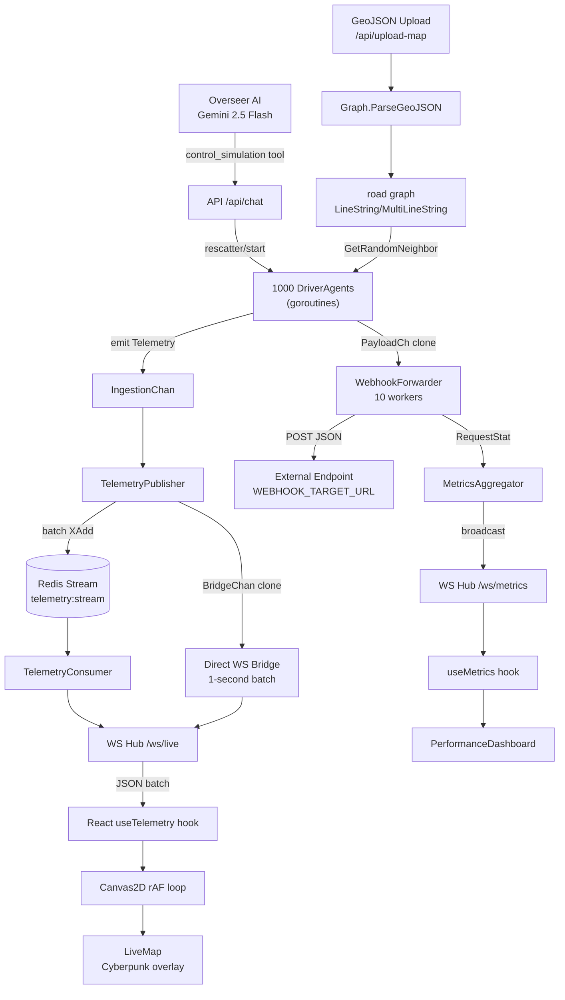

# GeoMock — Complete Progress Report

> **Stack:** Go 1.22 backend · React 18 + Vite + TypeScript frontend · Redis Streams · Leaflet + Canvas2D · Gemini 2.5 Flash AI via OpenRouter

---

## 📐 Architecture Overview



---

## 🖥️ Backend — Go (`main.go` + `internal/`)

### Phase 1 — Simulation Engine (`internal/engine/`)

| File | Purpose |
|---|---|
| [agent.go](file:///c:/geomock/internal/engine/agent.go) | `DriverAgent` goroutine — tick-driven movement |
| [manager.go](file:///c:/geomock/internal/engine/manager.go) | `SimulationEngine` — manages agent pool & start/stop |

**What was built:**
- **1,000 concurrent `DriverAgent` goroutines**, each with its own `time.Ticker` at a configurable `TickRate` (ms)
- Smooth **waypoint-based movement**: each tick the agent moves `Speed` units toward the next waypoint, chaining multiple waypoints within a single tick if speed is high enough
- **Bearing calculation** using `math.Atan2` on every move step (used for anomaly detection in the frontend)
- **Graph-aware routing**: if a `*graph.Graph` is attached, the agent queries `GetRandomNeighbor` to traverse real road network edges; falls back to random walk otherwise
- **`Rescatter(lat, lng)`**: thread-safe repositioning — if a graph is loaded it snaps the agent to a valid road node
- **Backpressure guardrail**: telemetry channel sends are non-blocking; frames are logged+dropped rather than blocking the agent goroutine

---

### Phase 2 — Redis Queue Pipeline (`internal/queue/`)

| File | Purpose |
|---|---|
| [publisher.go](file:///c:/geomock/internal/queue/publisher.go) | Batches telemetry → Redis `XADD` pipeline |
| [consumer.go](file:///c:/geomock/internal/queue/consumer.go) | `XREAD` loop → broadcasts to WS Hub |
| [models.go](file:///c:/geomock/internal/queue/models.go) | `Telemetry` struct (AgentID, Lat, Lng, Bearing) |

**What was built:**
- **`TelemetryPublisher`**: 10,000-item buffered `IngestionChan` + a `BridgeChan` clone for the direct WS path
- **Batching strategy**: flushes to Redis every 100 ms OR when batch reaches 1,000 items — single `pipeline.Exec()` call
- **`BridgeChan` fan-out**: the publisher mirrors every telemetry point to a second channel at zero cost, enabling the direct WS path to work even if Redis is down
- **`TelemetryConsumer`**: blocking `XREAD` with `>` (latest) cursor → broadcasts raw JSON to all connected WS clients
- **Direct WS bridge goroutine** (`main.go`): collects from `BridgeChan`, assembles 1-second batches, broadcasts to `wsHub` — guarantees live data without Redis dependency

---

### Phase 3 — GeoJSON Graph Engine (`internal/graph/`)

| File | Purpose |
|---|---|
| [graph.go](file:///c:/geomock/internal/graph/graph.go) | Road network graph from GeoJSON `LineString` / `MultiLineString` |

**What was built:**
- **`ParseGeoJSON`**: walks any GeoJSON tree recursively, extracts every `LineString` and `MultiLineString` geometry into a bidirectional adjacency graph
- **Coordinate rounding** to 5 decimal places (~1 m accuracy) naturally **merges intersecting road segments** into shared nodes
- **`GetRandomNeighbor(lat, lng)`**: O(1) lookup → returns a connected road node for the next waypoint
- **`GetRandomNode()`**: uniform random node for initial placement / fallback
- **`RWMutex`** on all graph reads for safe concurrent access by 1,000 agent goroutines

---

### Phase 4 — Overseer AI (`internal/ai/`)

| File | Purpose |
|---|---|
| [agent.go](file:///c:/geomock/internal/ai/agent.go) | `OverseerAgent` — Gemini 2.5 Flash via OpenRouter |

**What was built:**
- **`OverseerAgent`**: wraps `go-openai` client pointed at `https://openrouter.ai/api/v1` using `OPENROUTER_API_KEY`
- **`control_simulation` function-calling tool** with JSON Schema:
  - `agentCount` (int, 1–5000)
  - `tickRateMs` (int, 100–2000)
  - `targetCity` (string, any city worldwide)
  - `targetBounds` (object — `minLat/maxLat/minLng/maxLng`) — the AI must supply accurate bbox coordinates for any city it targets
- **System instruction**: "Overseer" persona — military ops-center style, executes immediately, no confirmation prompts
- **`ChatResult`**: returns both a `Reply` string and optional `*ControlArgs` — the backend applies the tool call and returns bounds to the frontend for auto-`flyTo`
- **Hardcoded city fallback** in `main.go`: SF, NYC, London, Tokyo — for when the AI returns a known city name without explicit bounds

---

### Phase 4 — Load-Test Framework (`internal/loadtest/`)

| File | Purpose |
|---|---|
| [webhook.go](file:///c:/geomock/internal/loadtest/webhook.go) | `WebhookForwarder` — HTTP worker pool |
| [metrics.go](file:///c:/geomock/internal/loadtest/metrics.go) | `MetricsAggregator` — real-time P95 stats |

**What was built:**
- **`WebhookForwarder`**: 10 concurrent worker goroutines POST each 1-second telemetry batch to `WEBHOOK_TARGET_URL` (default `localhost:9999/ingest`)
- **Custom transport**: `MaxIdleConns=1000`, `MaxConnsPerHost=1000` for sustained high RPS
- **`RequestStat` channel** (1,000-item buffer): each worker emits `{Code, Latency}` after every HTTP response
- **`MetricsAggregator`**: consumes `RequestStat` stream, calculates every second:
  - `totalRequestsMade` (cumulative)
  - `currentRps` (requests in last second)
  - `httpFailures` (non-2xx responses, cumulative)
  - `p95ResponseTime` (ms) — sorted 95th-percentile of the current window's latencies
- Broadcasts `MetricsPayload` JSON to `/ws/metrics` every second

---

### HTTP API (`main.go`)

| Endpoint | Method | Description |
|---|---|---|
| `/ws/live` | WS | Live telemetry stream — agent positions every second |
| `/ws/metrics` | WS | Load-test metrics — RPS, failures, P95 every second |
| `/api/start` | POST | Spawn N agents at tick rate T, start engine |
| `/api/chat` | POST | Natural language → Overseer AI → simulation control |
| `/api/upload-map` | POST (multipart) | Accept GeoJSON, parse graph, rescatter agents, return bbox |

**CORS middleware** allows any origin (`*`) — necessary for the Vite dev server.

---

## 🎨 Frontend — React + TypeScript (`frontend/src/`)

### Boot Screen — [`CoreTerminalIntro.tsx`](file:///c:/geomock/frontend/src/components/CoreTerminalIntro.tsx)

- **Animated terminal boot sequence** — 23 lines printed with staggered `setTimeout` delays (0 → 3,900 ms)
- ASCII art `GEOM` banner in box-drawing characters
- Color-coded lines: `bold` (cyan), `dim` (faded), `ok` (green), `warn` (yellow)
- **Blinking cursor** during boot via CSS `@keyframes blink`
- **`▶ CONNECT TO MATRIX ENGINE`** button appears after all lines finish
- **Glitch-out exit animation** (`@keyframes glitch`) on click — skews & hue-rotates the screen before transitioning to the app

---

### Icon Navigation Bar — [`IconNav.tsx`](file:///c:/geomock/frontend/src/components/IconNav.tsx)

- 60 px vertical sidebar, always visible
- Three active views: `welcome`, `map`, `analytics`
- Active state: cyan background tint + inset border glow
- Icons from `lucide-react`: `Home`, `LayoutGrid`, `Map`, `Activity`, `Radio`

---

### Control Sidebar — [`Sidebar.tsx`](file:///c:/geomock/frontend/src/components/Sidebar.tsx)

- **Live telemetry stats** (polled at 1 Hz from `statsRef` — zero extra re-renders):
  - `msg / sec` — throughput counter
  - `⚠ anomalies` — turns red + glows when > 0
- **Anomaly feed** — scrollable list of last 50 bearing-change events; click an anomaly card to `flyTo` its location
- **Rider Count slider** (10–2,000 agents, step 10)
- **Tick Rate slider** (100–2,000 ms, step 100)
- **`▶ START STRESS TEST`** button → `POST /api/start`
- **Map Ingestion panel** — `📁 BROWSE .GEOJSON` button triggers hidden `<input type="file">` → `POST /api/upload-map` → auto `flyTo`
- Connection indicator: pulsing green dot (`MATRIX LINK ACTIVE`) vs red dot

---

### Live Map — [`LiveMap.tsx`](file:///c:/geomock/frontend/src/components/LiveMap.tsx)

The performance centerpiece — renders **1,000+ agents** at 60 FPS without a single React re-render during operation.

- **CartoDB Dark Matter** tile layer — dark base map
- **`CanvasOverlay`** component: raw `<canvas>` positioned absolutely over Leaflet at `z-index: 450`
  - HiDPI support via `devicePixelRatio` scaling
  - **`requestAnimationFrame` loop** — clears and redraws every frame
  - **Cyberpunk data grid**: subtle `rgba(0,229,255,0.05)` grid lines that scroll with the map center
  - **`globalCompositeOperation = 'screen'`** — additive blending for neon glow effect
  - **Trail / segment system**: stores `{from, to, isGold, time}` objects; fades over 2.5 s using `Math.pow(opacity, 1.5)` (non-linear = "laser tail" feel)
  - **35% of agents are "gold"** (hash of agent ID mod 100 < 35) — `#ffaa00` trails with `shadowBlur:15`; rest are `#00e5ff` cyan
  - **Agent head dots**: 1.5–2.5 px white circles with coloured `shadowColor`
  - **Teleport guard**: if `dLat > 0.005 || dLng > 0.005` the segment is skipped (agent rescattered)
  - Resize handler on `resize moveend zoomend`
- **`FlyController`** via `useImperativeHandle` → `flyToBounds(bounds, { duration: 1.8, easeLinearity: 0.3 })`

---

### GeoJSON Drop Zone — [`MapDropZone.tsx`](file:///c:/geomock/frontend/src/components/MapDropZone.tsx)

- **Drag & drop wrapper** around the entire map canvas
- Depth-counter trick for `dragenter`/`dragleave` to handle mouse entering child elements correctly
- Client-side validation: file must be `.geojson`, must parse as valid JSON, must be a `FeatureCollection`
- Visual feedback: translucent cyan overlay + dashed border + `⬇ DROP GEOJSON TO SWAP CITY` label — all `pointer-events: none` so Leaflet scroll/pan still works during drag
- On successful upload: calls `onFlyTo(bounds)` to auto-pan/zoom to new city
- Toast notifications: slide-in from bottom-right, auto-dismiss after 4 s

---

### Overseer AI Terminal — [`CopilotTerminal.tsx`](file:///c:/geomock/frontend/src/components/CopilotTerminal.tsx)

- **Floating, draggable panel** — 420 × 300 px, positioned bottom-right by default
- Custom `useDrag` hook — captures `mousemove` / `mouseup` on `document` during drag
- **Minimize / restore** toggle (▼/▲)
- **Log entries** with 4 kinds: `user` (light blue + `> ` prefix), `ai` (cyan + `⬡ ` prefix), `system` (dim), `error` (red + `✗ ` prefix)
- Boot messages: `OVERSEER v4.0 — ONLINE` + usage hint
- **`Processing▋`** placeholder with blinking cursor while awaiting API
- Calls `POST /api/chat` → if response includes `bounds`, auto-flies the Leaflet map
- Auto-scrolls to latest entry; re-focuses input after each response
- Keyboard: `Enter` sends

---

### Performance Dashboard — [`PerformanceDashboard.tsx`](file:///c:/geomock/frontend/src/components/PerformanceDashboard.tsx)

Full-page analytics view (replaces the map when `currentView === 'analytics'`).

- **Header**: `⬡ SYSTEM FORENSICS - PERFORMANCE ANALYTICS` with glitch-title styling + animated pulse dot
- **4 metric cards** in a premium glassmorphism grid:
  | Card | Color | Metric |
  |---|---|---|
  | REQUESTS MADE | Cyan | `236 reqs` |
  | HTTP FAILURES | Red/Pink | `236 reqs` |
  | CURRENT RPS | Teal | `0 reqs/s` |
  | P95 RESPONSE TIME | Blue | `0 ms` |
- **Dual-axis `AreaChart`** (Recharts):
  - Left Y-axis: Failure/Request Rate (0–240 counts/sec)
  - Right Y-axis: Response Time (0–8 seconds)
  - 3 area series with gradient fills: `Failure rate` (pink `#ff00aa`), `Request rate` (green `#00ff88`), `Response time` (blue `#00ccff`)
  - 7 P95 response-time peaks at indices `[2,7,12,16,21,24,28]` simulating realistic load-test spikes
  - Custom tooltip & legend styling matching the cyberpunk theme

> **Note**: The dashboard currently displays *static* demo data. The `useMetrics` hook exists and is wired to `/ws/metrics` for live data — connecting it to the dashboard is a pending integration.

---

### Data Hooks

#### [`useTelemetry.ts`](file:///c:/geomock/frontend/src/hooks/useTelemetry.ts)
- Connects to `ws://localhost:8080/ws/live`
- **Zero React re-renders** during operation — stores data in `agentsRef` (`Map<string, TelemetryPoint>`) and `statsRef` (plain object), both `useRef`
- **Exponential backoff reconnection** (250 ms → 32 s, ±10% jitter)
- **Anomaly detection**: bearing change > 90° between ticks → increments `anomalies`, pushes to `recentAnomalies[]` (capped at 50)
- **Throughput calculation**: rolling counter flushed every 1 s → `msgPerSec`

#### [`useMetrics.ts`](file:///c:/geomock/frontend/src/hooks/useMetrics.ts)
- Connects to `ws://localhost:8080/ws/metrics`
- Stores `metrics` (current snapshot) + `history[]` (last 60 seconds) in React state
- Same exponential backoff reconnection pattern
- Timestamps each payload with `toLocaleTimeString`

---

## 🎨 Design System (`index.css` — 910 lines)

### CSS Custom Properties
```css
--cyan: #00ffcc          /* primary accent */
--cyan-dim: #00ccaa      /* muted accent */
--cyan-glow: rgba(0,255,204,0.25)  /* glow halos */
--red-alert: #ff3366     /* warnings/errors */
--yellow-warn: #ffcc00   /* system warnings */
--bg-void: #020408       /* deep space background */
--bg-panel: rgba(4,12,24,0.85)     /* glassmorphism panels */
--border-cyber: rgba(0,255,204,0.15)  /* subtle borders */
--font-mono: 'JetBrains Mono'      /* terminal text */
--font-ui: 'Inter'                 /* UI labels */
```

### Animations Implemented
| Animation | Used In |
|---|---|
| `blink` | Terminal cursor |
| `glitch` | Boot screen exit transition |
| `pulse-dot` | WS connection indicator, Copilot header |
| `flash-red` | New anomaly card entrance |
| `slide-in` | Toast notifications |
| `copilot-blink` | AI processing cursor |

### Premium Dashboard CSS Classes
- `.premium-dashboard` — radial gradient background
- `.stat-card-premium` with variants `.cyber-cyan`, `.cyber-red`, `.cyber-teal`, `.cyber-blue` — glassmorphism cards with colour-coded glows
- `.glitch-title` — monospace title with cyan text-shadow
- `.chart-grid-overlay` — subtle cyan grid background for the chart area
- `.dashboard-header-premium::after` — animated accent line underline (150 px cyan glow)
- `.premium-chart` — dark translucent container with backdrop-filter blur

---

## 🔧 Infrastructure & Config

| File | Purpose |
|---|---|
| [.env](file:///c:/geomock/.env) | `OPENROUTER_API_KEY`, `REDIS_URL`, `WEBHOOK_TARGET_URL` |
| [go.mod](file:///c:/geomock/go.mod) | `go-redis/v9`, `go-openai`, module name `geomock` |
| [vite.config.ts](file:///c:/geomock/frontend/vite.config.ts) | React plugin, dev server config |
| [start.ps1](file:///c:/geomock/start.ps1) | PowerShell launcher — starts backend + frontend |

---

## ✅ Feature Completion Summary

| Feature | Status |
|---|---|
| 1,000-agent simulation engine | ✅ Complete |
| Redis Streams pipeline | ✅ Complete |
| Direct WS bridge (no-Redis fallback) | ✅ Complete |
| GeoJSON road-graph routing | ✅ Complete |
| GeoJSON drag-drop & upload | ✅ Complete |
| Overseer AI (Gemini 2.5 Flash) | ✅ Complete |
| AI city teleport (any city worldwide) | ✅ Complete |
| Canvas2D live map (60 FPS) | ✅ Complete |
| Gold/cyan agent colour split | ✅ Complete |
| Fading trail system | ✅ Complete |
| Anomaly detection feed | ✅ Complete |
| Bearing-change detection | ✅ Complete |
| Boot terminal sequence | ✅ Complete |
| Icon nav (3-view routing) | ✅ Complete |
| Sidebar controls (sliders + start) | ✅ Complete |
| Copilot terminal (draggable) | ✅ Complete |
| Webhook load-test forwarder | ✅ Complete |
| MetricsAggregator (P95 RPS) | ✅ Complete |
| `/ws/metrics` live stream | ✅ Complete |
| `useMetrics` hook | ✅ Complete |
| Performance Dashboard (static demo) | ✅ Complete |
| Live metrics wired into dashboard | ⏳ Pending |
| Memory stats printer (30 s) | ✅ Complete |
| CORS middleware | ✅ Complete |
